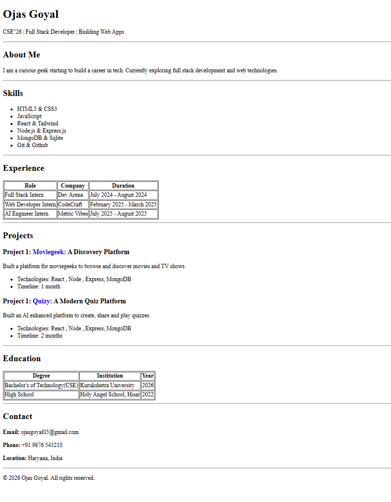

# Single Page Resume: Ojas Goyal

A simple single-page HTML resume (Resume.html) showcasing Ojas Goyal's profile, skills, experience, projects and contact details.

## Prerequisites
- Modern web browser (Chrome, Firefox, Edge, Safari)
- VS Code with Live Server extension

## Setup

1. Place the repository or folder containing `Resume.html` on your machine:
    - Example path: `C:\Users\User\Single Page Resume\Resume.html`

2. Open directly in a browser:
    - Double-click `Resume.html` or right-click → Open with → your browser.

3. (Recommended) Serve locally for correct relative asset behavior:
    - Using VS Code Live Server: Open folder in VS Code, right-click `Resume.html` → "Open with Live Server".

## Usage
- Edit `Resume.html` to update name, header, sections (About, Skills, Experience, Projects, Education, Contact).
- Save and refresh browser to preview changes.

## Screenshot
